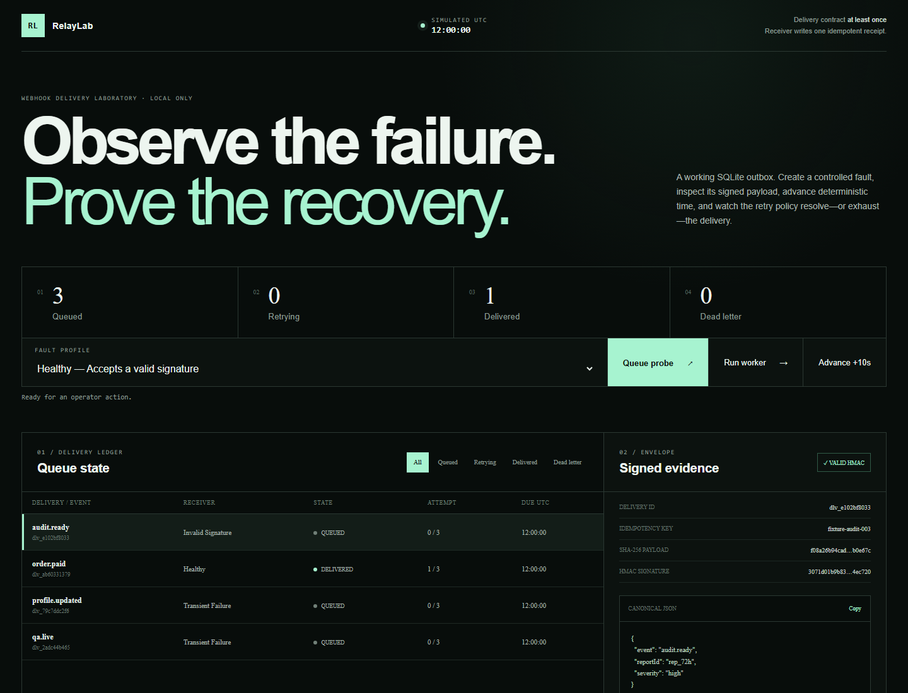

# RelayLab

RelayLab is a local webhook outbox laboratory. It pairs a React/TypeScript operations console with a Python standard-library HTTP API and a persisted SQLite queue. The demo lets an operator submit controlled deliveries, run one worker claim, advance a deterministic simulated clock, inspect HMAC evidence, and replay completed or dead-lettered work.



The lab models **at-least-once delivery** with bounded retries and explicit dead-letter handling. A built-in receiver stores one receipt per delivery ID, so a successful replay demonstrates receiver-side idempotence without claiming exactly-once transport.

## Run locally

Requirements: Python 3.12+, Node.js 24+, and pnpm 11+.

```powershell
pnpm install
pnpm dev
```

Open `http://127.0.0.1:5179`. The API listens only on `127.0.0.1:8179`; the launcher starts both processes. Delete `relay-lab.sqlite3` while stopped to restore the initial three fixtures on the next start.

## Useful commands

```powershell
pnpm test
pnpm typecheck
pnpm build
```

The three receivers are simulations inside the backend. `healthy` accepts a verified envelope, `transient_failure` returns one controlled 503 before accepting, and `invalid_signature` mutates the payload before verification and therefore exhausts the configured attempts. RelayLab never sends arbitrary outbound HTTP.

See [BACKEND.md](BACKEND.md), [FRONTEND.md](FRONTEND.md), [TESTING.md](TESTING.md), and [SECURITY.md](SECURITY.md) for the implemented boundaries.

Copyright © 2026 Ibrahim Boutiba. No license is granted; see [NOTICE](NOTICE).
